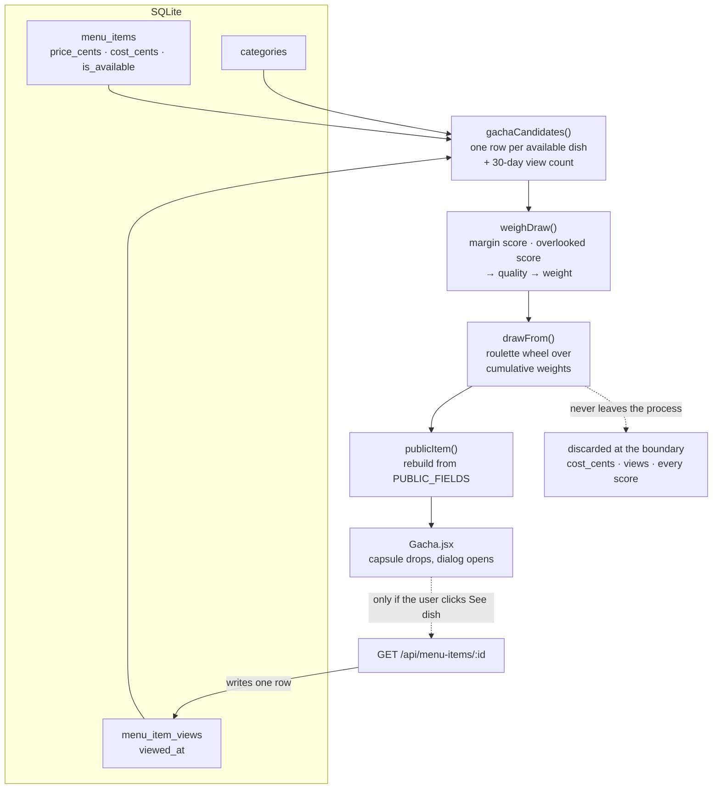

# 一品ガチャ — the dish gacha

A capsule machine on the menu page. Turn the dial and it hands back one dish.

The toy is the surface. The draw is weighted toward dishes that are **both profitable and
overlooked**, so it is a merchandising device wearing a capsule machine. It is the only consumer
of `menu_items.cost_cents` that changes what a customer sees, and it gives the 30 days of
`menu_item_views` history a job beyond reporting.

| Concern | File |
| ------- | ---- |
| The pool query | `backend/analytics/queries.js` → `gachaCandidates()` |
| The weighting maths | `backend/menu/gacha.js` |
| HTTP and the field boundary | `backend/routes/gacha.js` |
| Verification | `backend/db/gacha-weights.js` (`npm run gacha-weights`) |
| UI | `frontend/src/Gacha.jsx`, `frontend/src/gacha.css` |

## Data flow at a glance



The dotted edges are the two deliberate gaps, and they are the whole design:

- **Nothing is written on a draw.** The write back into `menu_item_views` happens only on
  click-through.
- **Cost never reaches the client.** The scores are computed and discarded server-side.

## Stage by stage

### 1. Pool — `gachaCandidates({ category_id, window_days })`

The only SQL. Lives in `analytics/queries.js` rather than the route because it is the same
LEFT-JOIN-over-`menu_item_views` shape as `popularItems()`, and a second copy would be a second
definition of "views in a window" that could drift from the manager's report.

```sql
SELECT m.*, c.name AS category_name, COUNT(v.id) AS views
FROM menu_items m
JOIN categories c ON c.id = m.category_id
LEFT JOIN menu_item_views v
  ON v.menu_item_id = m.id AND v.viewed_at >= @cutoff
WHERE m.is_available = 1
  AND (@category_id IS NULL OR m.category_id = @category_id)
GROUP BY m.id
ORDER BY m.id
```

Four things in that query are load-bearing:

| Detail | Why |
| ------ | --- |
| `LEFT JOIN`, not `INNER` | A dish with zero views must survive. Under an `INNER JOIN` the most overlooked dishes — the ones this feature exists to promote — silently vanish from the pool. |
| The date bound rides in the **join predicate**, not a `WHERE` | In a `WHERE` clause it would filter those zero-view rows back out after the join had kept them. |
| `v.viewed_at >= @cutoff` compares the bare column | Wrapping it in a function makes `idx_views_item` unusable. Same rule as the rest of `queries.js`. |
| `ORDER BY m.id` | `drawFrom()` walks the array in order, so a stable order is what lets the verification script reproduce a draw under a seeded RNG. |

`WHERE m.is_available = 1` is **unconditional** — it deliberately ignores `canSeeUnavailable()`
from `routes/menuItems.js`. That is a *browsing* permission (staff need to see what is off the
board); this is a *recommendation*, and recommending a dish the kitchen is not cooking is wrong no
matter who asks. Every role draws from the dishes a customer could actually order.

**Row shape out:** every `menu_items` column, plus `category_name`, plus `views`.

### 2. Score — `weighDraw(rows)`

Pure arithmetic on plain objects. Imports only `effectivePriceCents` from `menu/pricing.js` — no
`db`, no `express`, which is what lets `gacha-weights.js` re-run it over the whole menu without a
request.

Two signals, each normalised to `[0,1]` across the pool.

**Margin** — `effectivePriceCents(row) − cost_cents`, min-maxed.

Off the *effective* price, not `price_cents`: the special is what the shop banks. Curry Udon lists
at $13.50 but runs 26% off, so its margin is 569¢ rather than 920¢. Using the list price would make
the machine push discounted dishes hardest, which is backwards — a special is already a promotion.
This also keeps one definition of margin in the app, matching `menuProfitability()`.

In cents, not percent, because rent is paid in cents: Sukiyaki is a 34% margin but banks 950¢ a
serving, more than anything else on the board.

**Overlooked** — `1 / log₂(views + 2)`, min-maxed.

The `+ 2` is the zero-view guard as arithmetic rather than a branch: the argument never drops below
2, so the result never exceeds 1, and a dish with no views scores exactly 1.0 by construction. Log
damping rather than `1/views` because view counts are heavy-tailed — a linear inverse would let one
runaway dish flatten every other score into noise.

**Blend**

```js
quality = 0.5 * marginScore + 0.5 * overlookedScore   // [0,1]
weight  = FLOOR + (1 - FLOOR) * quality ** GAMMA      // [0.15, 1]
```

**Candidate shape out:**
`{ row, margin_cents, margin_score, views, overlooked_score, quality, weight, probability }`
— the full audit trail, not just the number, so the verification script prints exactly what the
selector consumes and the two can never drift.

### 3. Draw — `drawFrom(candidates, total, rng)`

Roulette wheel: walk the cumulative weights, stop where `rng() * total` lands. `O(n)` per draw,
deliberately — the pool is a restaurant menu, and an alias table's `O(n)` build costs more than the
scan it replaces against a menu a manager edits live.

`rng` is injected rather than exposed as a `?seed=` parameter. A caller-controlled seed would let
anyone sweep seeds and read the weight ordering straight off the machine — which is the margin
ranking of the menu, the one thing this must not publish. Reproducibility is a bench tool, and
`db/gacha-weights.js` is the bench.

### 4. Shape — `publicItem(row)`

```js
const PUBLIC_FIELDS = ['id', 'category_id', 'category_name', 'name', 'description',
  'price_cents', 'special_price_cents', 'discount_percent', 'special_starts_at',
  'special_ends_at', 'image_path', 'is_available', 'created_at', 'updated_at'];
```

Named explicitly rather than handing the row to `decorate()`, which spreads `...item` and would
carry `cost_cents`, the view count and every intermediate score out with it. **The only reliable
place to stop a column is before it leaves.** If this list is ever replaced with `decorate(row)`
because that is shorter, the margins go out with it.

> Pre-existing, neither introduced nor fixed here: `GET /api/menu-items` uses `SELECT m.*` and
> `GET /api/menu-items/:id` uses `SELECT *`, both through `decorate()`, so `cost_cents` already
> reaches customers on those endpoints. That is worth fixing on its own terms; a new endpoint
> should not add a second door to it in the meantime.

The result is byte-for-byte the shape `GET /api/menu-items/:id` returns, so the client needs no
second mapping.

## The write path — and why a draw isn't on it

A draw is an **impression**, not a view. `routes/gacha.js` deliberately never calls `recordView()`.

The gacha reads `menu_item_views` to find the dishes nobody looks at. Writing a view on every draw
would let the machine inflate the very signal it reads from: promote a quiet dish, count its own
promotion as interest, demote it again — without a single customer having looked at anything. The
counter would be measuring the machine, not the room.

The view is written only if someone clicks **See dish**, which routes through the write that
already exists — `Menu.jsx` → `revealItem()` → `GET /api/menu-items/:id` → `recordView()`.

This is also why the endpoint is a `GET` with `Cache-Control: no-store` rather than a `POST`. A
`POST` would imply the server recorded something; a verb that lies about its side effects is worse
than a `GET` that needs a cache header.

### The loop that remains is the intended one

```
promoted dish → someone opens it → real view recorded → overlooked score falls
    → weight falls → machine moves to the next dish nobody has found
```

Self-correcting, and it only works because the machine is not feeding its own input.

## A worked example

From one run of `npm run gacha-weights` against the seeded menu. **These numbers are generated,
never transcribed** — re-run the script rather than trusting this table.

| Dish | Margin ¢ | Views 30d | M | O | Quality | Weight | Draw % |
| ---- | -------: | --------: | ----: | ----: | ------: | -----: | -----: |
| Sesame Sauce Salad | *none* | 68 | 0.265 | 1.000 | 0.633 | 0.490 | **17.9%** |
| Sardine Ochazuke | 670 | 68 | 0.265 | 1.000 | 0.633 | 0.490 | **17.9%** |
| Tofu Udon | 810 | 110 | 0.633 | 0.622 | 0.627 | 0.484 | **17.7%** |
| Sukiyaki | 950 | 246 | 1.000 | 0.129 | 0.565 | 0.421 | 15.3% |
| Japanese Curry Rice | 850 | 318 | 0.738 | 0.000 | 0.369 | 0.266 | 9.7% |
| Napa Cabbage, Enoki and Pork Soup | 650 | 140 | 0.213 | 0.458 | 0.335 | 0.246 | 9.0% |
| Air-fried Chicken | 630 | 216 | 0.160 | 0.199 | 0.180 | 0.177 | 6.5% |
| Japanese Curry Udon | 569 | 178 | 0.000 | 0.310 | 0.155 | 0.170 | 6.2% |

Uniform would be 12.5% each. Air-fried Potato Wedges is absent because it ships `is_available = 0`.

Curry Rice is the second-best margin on the menu and the **most viewed** — so it draws *below*
uniform. That is the feature working.

## Design decisions

### `GAMMA = 2` is what turns a sum into an AND

Quality is a plain average, so a dish reaches 0.5 by being perfect on one axis and worst on the
other. Squaring is convex — it pushes the middle down harder than the top:

- Sukiyaki, best margin on the menu but second-most-viewed: quality 0.565 → **0.319**
- Tofu Udon, merely good at both: quality 0.627 → **0.394**

Tofu Udon is 11% ahead on quality but 23% ahead on weight. One exponent buys the word "and".

Rejected: the literal product `M × O`. It enforces AND more bluntly but zeroes any dish sitting at
the bottom of either min-max scale — and min-max guarantees exactly one dish sits at 0 on each axis.
Those two would collapse to the floor as an artefact of the normalisation rather than anything about
the dish.

### `FLOOR = 0.15` is what makes it a gacha and not a vending machine

Every weight lands in `[0.15, 1.0]`, so every dish stays drawable and the machine can always
surprise you. It is also the total-weight guarantee: `total ≥ 0.15n > 0` for any `n ≥ 1`, so the
draw can never divide by zero regardless of what the menu looks like.

### An unknown cost is estimated, not excluded

`menu_items.cost_cents` is nullable — schema.sql calls it out: *"an item whose cost nobody has
entered yet is excluded from margin reporting rather than being reported as 100% profit."*

Margin is therefore only defined where cost is, but the draw must give **every** dish in the pool a
weight. Three options:

| Option | What it does | Verdict |
| ------ | ------------ | ------- |
| Exclude the dish | Machine holds fewer dishes than the menu shows | A data-entry gap in the office would edit the dining room |
| Treat cost as 0 | Reports it as pure profit | Exactly what the schema comment refuses to do — it would make that dish the most promoted on the board |
| **Median of the priced dishes** | "As promoted as a typical dish on *this* menu" | **Chosen** (`menu/gacha.js:136`) |

A flat `0.5` was also rejected: it means "assume it beats most of the menu" whenever the menu skews
low, which on this menu is the shape. `gacha-weights.js` prints which dishes are riding on the
estimate, so the fix is obvious — enter the cost.

### Degenerate cases resolve in the arithmetic, not in branches

| Case | Behaviour |
| ---- | --------- |
| Every dish has a null cost | Margin stops discriminating (all `0.5`); the draw runs on the overlooked signal alone |
| One dish in the pool | Both axes flat → `quality = 0.5` → trivially returned |
| Identical margins, or identical view counts | That axis goes neutral, which is correct — it carries no information |
| Empty pool | Short-circuits before the maths: `200` with `item: null`, never a `404` |
| "All dishes already viewed" | **Not a state.** Views lower a weight; they never remove a dish. There is no exhausted machine. |

## Verification

There is no test framework in this project. The claim is made falsifiable instead:

```
docker compose exec backend npm run gacha-weights
```

It prints the full weight table, then draws 100,000 times through the **real exported
`drawFrom()`** under a seeded `mulberry32`, and compares observed frequency against computed
probability. Then it tests the merchandising claim directly — splitting the pool at the median
margin and the median view count — and **exits non-zero** if either half fails to out-draw its
opposite.

Last run: high-margin half `1.96×`, overlooked half `1.65×`, max |Δ| `0.12pp`, all invariants pass.

To confirm the impression-not-a-view boundary by hand:

```
npm run inspect-db          # note menu_item_views
# ...draw ten times through the UI or curl...
npm run inspect-db          # count must be UNCHANGED
# ...click "See dish" once...
npm run inspect-db          # count must be exactly +1
```

## API

`GET /api/gacha?category_id=&exclude=` — any authenticated role. See
[api-endpoints.md](api-endpoints.md) for the full contract.

| Param | Effect |
| ----- | ------ |
| `category_id` | Narrows the pool. Normalisation then runs over the filtered pool, so "overlooked" correctly means *overlooked within that course*. |
| `exclude` | The previous draw's id, so "Turn again" is a different capsule. **Ignored when honouring it would empty the pool** — a one-dish course returns the same dish with `draw.repeated: true` rather than nothing. |

```json
{
  "item": { "id": 25, "name": "Tofu Udon", "category_name": "Noodles & Rice",
            "price_cents": 1100, "effective_price_cents": 1100, "is_on_special": false, "…": "…" },
  "draw": { "pool_size": 8, "category_id": null, "repeated": false,
            "drawn_at": "2026-08-07 14:02:11" }
}
```

`pool_size` is the only draw metadata that leaves. It is not sensitive — you can count the dishes on
the page — and it is what lets the UI say "1 of 8 dishes in the machine tonight".
